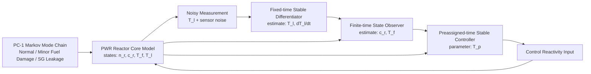
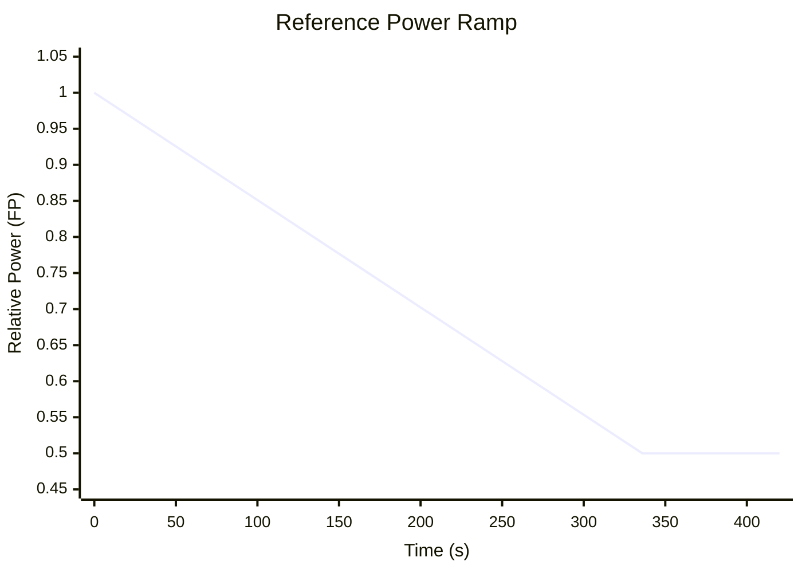
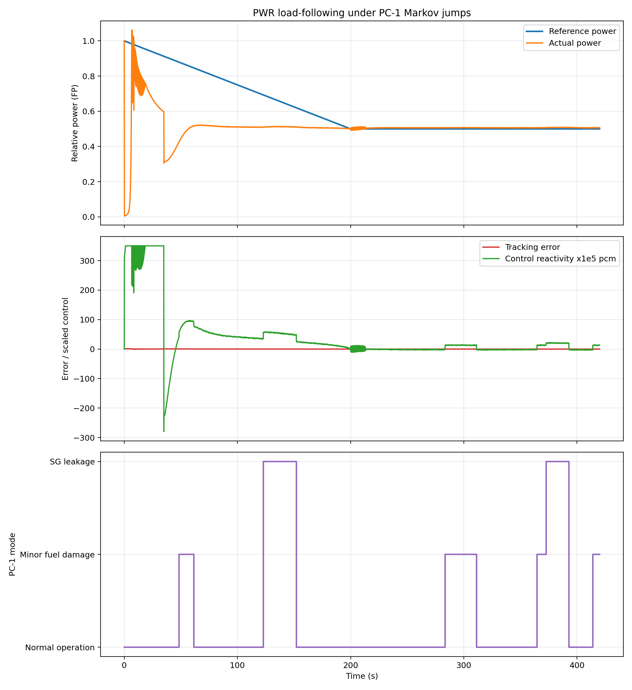
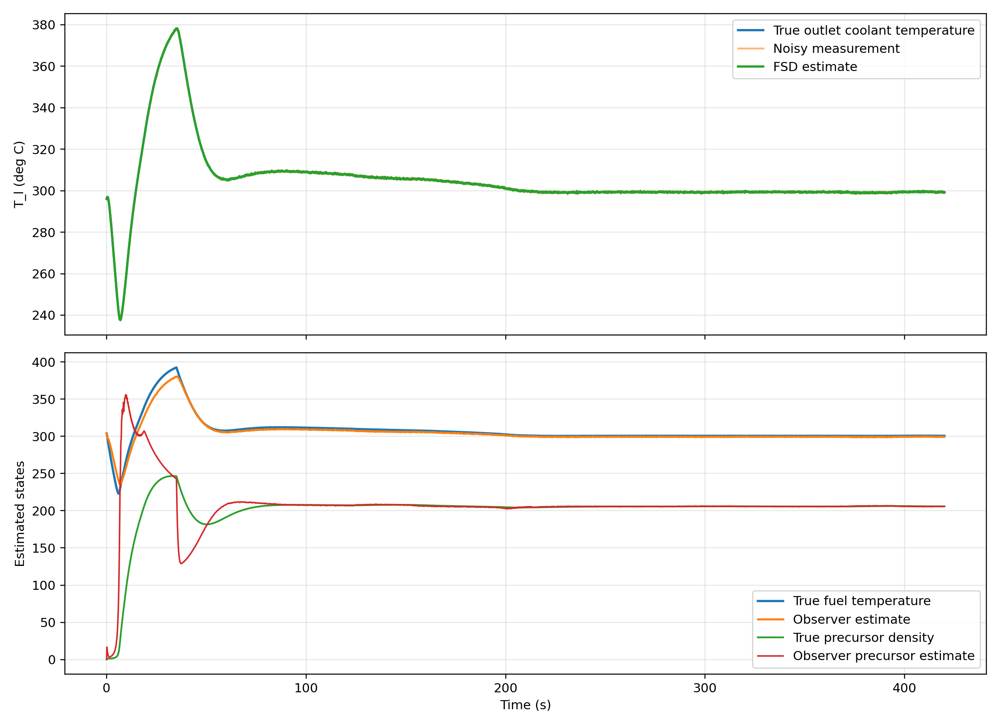

# High-precision Rapid Load-following Control of PWR under PC-1

> 面向 **Plant Condition 1 (PC-1)** 随机场景的压水堆（PWR）高精度快速负荷跟踪控制仿真平台  
> 基于四状态堆芯模型、马尔可夫跳变参数、固定时间微分器、有限时间观测器与预设时间稳定控制器

## 项目概述

本项目以论文 *High-precision rapid load following control strategy of a PWR under Plant Condition 1* 为技术背景，构建了一个面向工程展示与控制验证的 Python 仿真平台。目标是在 **PC-1 工况** 下研究压水堆从满功率到半功率的快速负荷跟踪能力，并考察控制系统在随机模式切换和测量噪声共同作用下的鲁棒性。

与传统仅关注稳态调节的建模方式不同，本项目强调三个关键点：

- **随机工况建模**：将正常运行、轻微燃料元件损伤、蒸汽发生器泄漏三种 PC-1 子工况纳入统一的马尔可夫跳变框架；
- **快速状态重构**：在冷却剂出口温度含噪测量条件下，利用固定时间微分器与有限时间观测器重建系统内部状态；
- **预设时间收敛**：控制器显式引入 `T_p`，使跟踪误差的收敛速度具备可设计性与可解释性。

该仓库适合用于：

- 控制理论课程设计与项目报告
- 核反应堆负荷跟踪控制方法展示
- 马尔可夫跳变系统与有限/固定时间算法原型验证
- 后续扩展为智能控制或强化学习补偿框架

## 研究背景

在新能源占比不断提升的背景下，核电机组不仅需要提供基荷，还需要承担更灵活的功率调节任务。压水堆在参与电网调峰时，会面临功率、温度反馈、冷却能力以及设备状态变化之间的强耦合问题。对于 **PC-1** 这类允许继续运行但存在扰动与退化风险的工况，控制系统必须同时满足以下要求：

- 功率跟踪误差小；
- 收敛速度快；
- 对工况突变具有鲁棒性；
- 对噪声测量与未直接测量状态具备容忍能力。

本项目正是在这一问题背景下，围绕“**模型 - 观测 - 控制**”的一体化闭环设计展开。

## 系统架构

### 闭环结构总览



### 模块职责说明

| 模块 | 作用 | 输出 |
|---|---|---|
| `PWRCoreModel` | 实现四状态堆芯动力学与热工反馈 | `n_r, c_r, T_f, T_l` |
| `Markov Chain` | 生成 PC-1 模式随机切换路径 | 模式序列 |
| `FixedTimeStableDifferentiator` | 处理含噪 `T_l` 测量并估计导数 | `T_l_hat, dT_l/dt_hat` |
| `FiniteTimeStateObserver` | 在线重构 `c_r` 与 `T_f` | `c_r_hat, T_f_hat` |
| `PreassignedTimeController` | 根据误差与估计状态产生控制反应性 | `u(t)` |
| `Simulation Engine` | 用 `solve_ivp` 完成闭环积分 | 全时域响应结果 |

## 数学基础

### 1. 四状态压水堆模型

系统状态定义为：

```math
x = [n_r,\; c_r,\; T_f,\; T_l]^\top
```

其中：

- `n_r` 为相对中子功率
- `c_r` 为缓发中子先驱核密度
- `T_f` 为平均燃料温度
- `T_l` 为平均冷却剂出口温度

核心动力学采用点堆方程与热工集中参数模型耦合形式：

```math
\dot{n}_r = \frac{\rho - \beta}{\Lambda} n_r + \lambda c_r
```

```math
\dot{c}_r = \frac{\beta}{\Lambda} n_r - \lambda c_r
```

```math
\dot{T}_f = q_f(n_r,\delta) - \frac{T_f - T_l}{\tau_f}
```

```math
\dot{T}_l = k_c(T_f - T_l) - g(\delta)\frac{T_l - T_{in}}{\tau_l}
```

总反应性写为：

```math
\rho = u + \alpha_f(T_f - T_f^\star) + \alpha_l(T_l - T_l^\star) + \rho_\delta
```

其中 `u` 为控制反应性，`rho_delta` 为模式相关扰动项，`delta` 表示当前 PC-1 模式。

### 2. 马尔可夫跳变参数

本项目考虑三种 PC-1 运行模式：

1. 正常运行
2. 轻微燃料元件损伤
3. 蒸汽发生器泄漏

模式切换由连续时间马尔可夫链生成矩阵 `Q` 描述，离散仿真时通过矩阵指数得到转移概率矩阵：

```math
P = e^{Q\Delta t}
```

这样可在数值仿真中得到一个可重复采样的随机工况路径，从而评估控制器对工况突变的适应能力。

### 3. 预设时间稳定控制

功率参考轨迹记为 `n_d(t)`，跟踪误差定义为：

```math
e(t) = n_r(t) - n_d(t)
```

控制器采用带时间增益调度的预设时间形式：

```math
u = -k_1 \Gamma(t)\operatorname{sig}(e)^{1/2} - k_2 \Gamma(t)e + u_{temp}
```

```math
\Gamma(t) = \left(\frac{T_p}{T_p - t}\right)^2,\quad t < T_p
```

其中：

- `T_p` 是用户可调的预设收敛时间；
- `u_temp` 用于补偿温度反馈带来的附加扰动；
- 当 `t >= T_p` 时，控制器切换到后续保持增益，以抑制残余误差并维持稳定跟踪性能。

### 4. 状态观测与微分

针对含噪的 `T_l` 测量，本项目使用固定时间微分器恢复温度及其变化率；再通过有限时间状态观测器估计 `c_r` 与 `T_f`。这一设计避免了对全部内部状态的直接测量依赖，增强了方案的工程可实现性。

## 仿真工况

本项目默认执行如下负荷跟踪任务：

- 初始功率：`100% FP`
- 目标功率：`50% FP`
- 功率下降速率：`0.0025 FP/s`
- 数值积分器：`scipy.integrate.solve_ivp`
- 模式环境：三模态 PC-1 马尔可夫跳变
- 测量场景：冷却剂出口温度带高斯噪声

参考功率轨迹如下：



## 结果展示

### 1. 负荷跟踪与模式切换

下图展示了目标功率、实际功率、跟踪误差、控制反应性以及 PC-1 模式切换过程。可用于观察预设时间控制器在随机工况跳变下的跟踪性能与控制动作强度。



### 2. 观测器与微分器性能

下图展示了冷却剂出口温度真实值、含噪测量与 FSD 估计结果，以及燃料温度与缓发中子先驱核密度的观测效果。该图有助于直观评估状态重构精度与抗噪能力。



### 3. 结果解读

从仿真结果可以观察到：

- 实际功率能够跟随从 `1.0 FP` 到 `0.5 FP` 的降功率指令；
- 在模式发生随机跳变时，系统仍保持整体稳定；
- FSD 对含噪 `T_l` 测量具有明显平滑效果；
- 有限时间观测器可以较快恢复 `T_f` 和 `c_r` 的变化趋势；
- `T_p` 的显式引入使控制器的收敛速度具备良好的可调性。

## 工程实现亮点

### Preassigned-time convergence

控制器把收敛时间从“只能调经验增益间接影响”的形式，转化为“可以直接设计的参数 `T_p`”。这使得系统在工程展示、参数整定与方法比较时更具可解释性。

### Robustness against PC-1 transitions

通过马尔可夫跳变建模，系统不再假设装置始终处于单一理想状态，而是显式纳入 PC-1 运行阶段的模式变化。这使仿真更贴近实际扰动环境，也更适合作为鲁棒控制验证平台。

### Observer-based implementation

项目将噪声测量、导数估计和内部状态重构纳入统一闭环，而不是仅仅做“理想全状态反馈”演示，因此更接近真实控制系统的实现逻辑。

## 安装与运行

### 环境依赖

项目依赖以下 Python 包：

- `numpy`
- `scipy`
- `matplotlib`

安装命令：

```bash
pip install -r requirements.txt
```

### 快速开始

在仓库根目录运行：

```bash
python main.py
```

程序将自动完成：

1. 生成 PC-1 模式随机切换路径
2. 执行闭环数值积分
3. 输出终端统计信息
4. 保存结果图到 `outputs/`

若希望运行时直接弹出图窗，可设置：

```bash
PWR_SHOW_PLOTS=1 python main.py
```

## 代码结构

```text
.
├── main.py
├── README.md
├── requirements.txt
├── docs/
│   └── figures/
│       ├── load_following_summary.png
│       └── observer_differentiator_summary.png
└── pwr_pt_rl_control/
    ├── __init__.py
    ├── config.py
    ├── controller.py
    ├── markov.py
    ├── model.py
    ├── observer.py
    ├── plotting.py
    └── simulation.py
```

## 编码风格

项目采用面向对象与模块化相结合的组织方式：

- 参数、模型、控制器、观测器、仿真器彼此解耦；
- 关键模块单独封装，便于更换模型参数或控制律；
- 代码注释保持克制但足够说明关键计算环节；
- 提供统一主入口，适合直接演示、复现实验或用于课程报告。

## 后续可扩展方向

- 使用论文原始参数表进行更严格的数值对齐
- 引入更高保真度的热工水力子模型
- 增加神经网络补偿项或自适应控制模块
- 将该框架扩展为强化学习辅助的负荷跟踪平台
- 支持多组工况批量仿真与自动生成报告

## 说明

本仓库当前版本重点在于**控制结构复现、随机工况建模与可视化展示**。如果后续需要将结果进一步对齐到论文中的具体图表或表格，可以直接在现有架构上替换模式转移参数、热工边界条件和控制器细节，而不需要重写整体工程框架。
